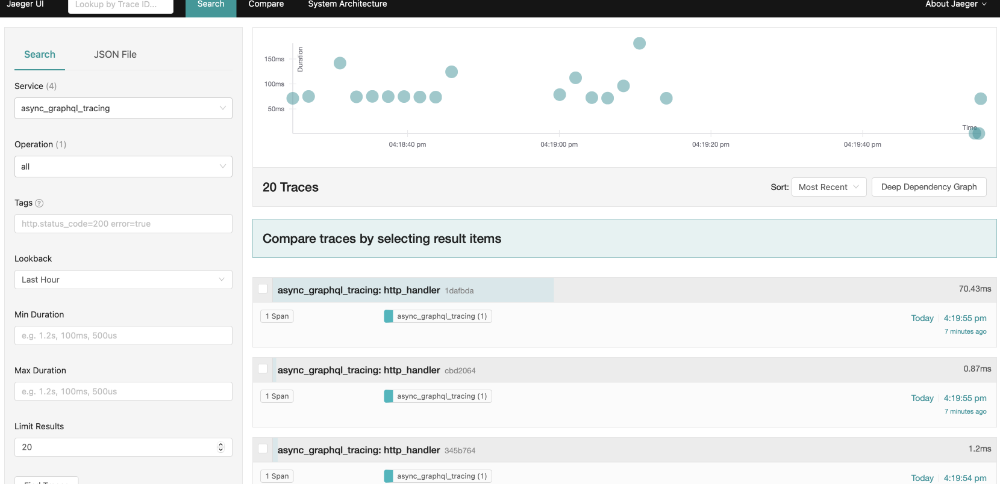
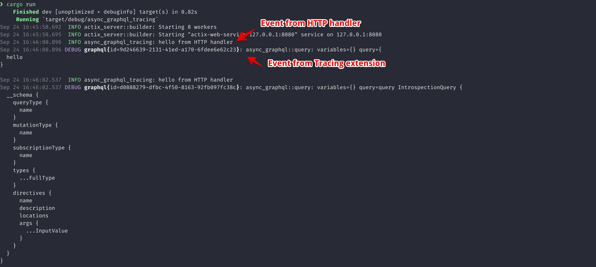

Example project
===============

This is an example project for [async-graphql/async-graphql/issues/278](https://github.com/async-graphql/async-graphql/issues/278).

1. Start Jaeger:
    ```
    docker run --rm \
      -e COLLECTOR_ZIPKIN_HTTP_PORT=9411 \
      -p 5775:5775/udp \
      -p 6831:6831/udp \
      -p 6832:6832/udp \
      -p 5778:5778 \
      -p 16686:16686 \
      -p 14268:14268 \
      -p 14250:14250 \
      -p 9411:9411 \
      jaegertracing/all-in-one:1.19
    ```
2. Start this project: `cargo run`.
3. Go to `http://localhost:8080` and run some queries.
4. Go to Jaeger at `http://localhost:16686`.

In Jaeger we can see that span that is declared on HTTP handler layer is reported



But no spans reported from Tracing extension.

In logs we can see events from both HTTP handler and Tracing extension:



Interesting observation.
In this project I was able to see `async_graphql::query` events from extension in logs,
but in my real project, they don't appear for some reason. 
